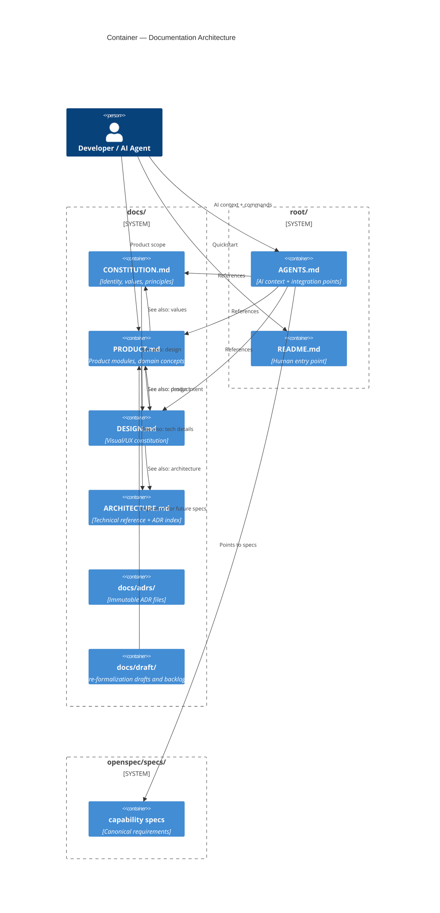

## Context

Three new canonical docs exist: `docs/CONSTITUTION.md`, `docs/PRODUCT.md`, `docs/DESIGN.md`. No cross-links between them. `PRODUCT.md` omits draft details worth preserving. No single file tracks "what was considered but not yet formalized."

## Decisions

### D1: Backlog lives in `docs/draft/`

`docs/draft/` holds pre-formalization content: drafts, backlogs, exploratory docs. Not authoritative. Not linked as source of truth. Files here serve as reference for future OpenSpec specs or implementation.

**Backlog selection criteria** — topics go to `docs/draft/product-backlog.md` if ALL:
- Present in `docs/old/product-context.md` but omitted from `PRODUCT.md`
- Not yet in an OpenSpec capability spec
- Specific enough to guide future implementation (not vague ideas)
- Not contradicted by current architecture or domain decisions

**Topics excluded from backlog** (too vague or already resolved):
- "Gestão de Ministérios" — covered by module scope, not a feature backlog
- "Escala de Voluntários" — single sentence, no detail
- Anything already in `docs/adrs/` or `openspec/specs/`

### D2: Cross-links use Markdown reference-style links

Each doc gets a **"See also"** section at bottom. Links point to specific sections, not root files. No circular references (A→B→C→A).

```
docs/PRODUCT.md         → docs/ARCHITECTURE.md, docs/DESIGN.md, AGENTS.md
docs/CONSTITUTION.md    → docs/PRODUCT.md, docs/DESIGN.md
docs/DESIGN.md         → docs/PRODUCT.md, packages/ui
AGENTS.md              → openspec/specs/, docs/PRODUCT.md, docs/DESIGN.md
```

**Rule:** link to the most specific section available. Prefer `[Stack por Camada](docs/ARCHITECTURE.md#stack-por-componente)` over `[docs/ARCHITECTURE.md](docs/ARCHITECTURE.md)`.

### D3: "Specs relacionados" section in AGENTS.md

Root `AGENTS.md` gets a **"Specs relacionados"** section listing relevant `openspec/specs/<capability>/spec.md` files. This satisfies the requirement from `define-documentation-source-of-truth` that AGENTS.md files point to specs instead of duplicating requirements.

### D4: No duplication check

`PRODUCT.md`, `CONSTITUTION.md`, `DESIGN.md` must not describe the same fact. If a statement appears in two files, it belongs to the most authoritative one and the duplicate is removed.

**Authority order:** `CONSTITUTION.md` (values/principles) > `PRODUCT.md` (product/domain) > `DESIGN.md` (visual/UX intent).

**Check method:** grep for common phrases shared across all three files. Any overlap flagged for removal.

### D5: Backlog format

`docs/draft/product-backlog.md` uses grouped bullet lists by domain area. Each item: topic name + 1-3 sentences of context + "Status: proposed|open|deferred". No Gherkin, no formal requirements — raw backlog, not specs.

## C4 Documentation Architecture



## Risks

- **[Risk]** Backlog grows stale without review → **Mitigation:** quarterly review, promote items to OpenSpec specs or delete
- **[Risk]** Cross-links create circular references → **Mitigation:** link to specific sections, verify with link checker
- **[Risk]** Backlog items treated as commitments → **Mitigation:** clearly marked "draft — not authoritative"

## Open Questions

- `docs/old/` will be removed — should `docs/old/` content be migrated to `docs/draft/` before removal, or deleted? (Decision needed before change #4 `archive-legacy-context-docs` is applied)
- Should `docs/draft/` have its own `AGENTS.md` or is it small enough to not need one?