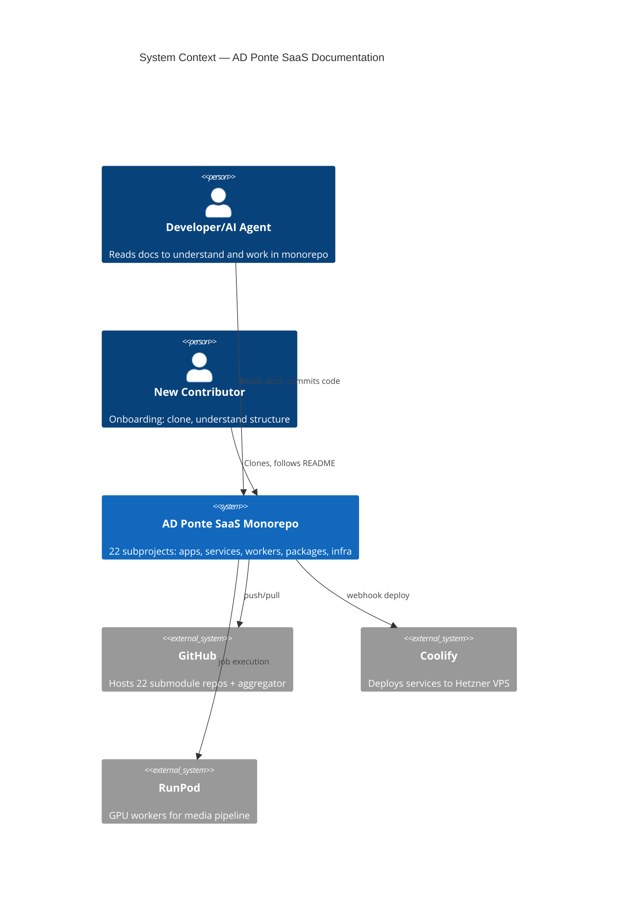
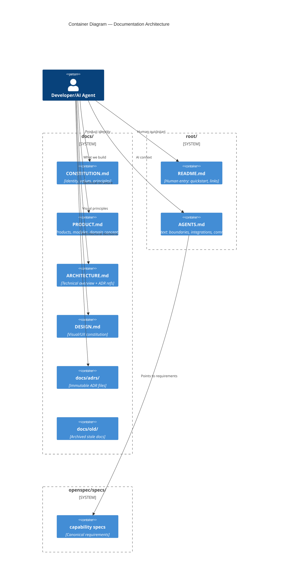

## Context

Monorepo com 22 subprojetos. Docs fragmentation:

- `AGENTS.md` vs `AGENTE.md` — filename inconsistency
- Sem fonte de verdade: sem hierarchy entre docs
- `docs/context/` stale vs actual architecture
- Subproject docs duplicam conteúdo global ao invés de referenciar
- 9 ADRs inline em `ARCHITECTURE.md` — sem path pra `docs/adrs/`

## Goals / Non-Goals

**Goals:**
- Hierarquia onde cada doc = 1 propósito
- Eliminar `AGENTE.md` → `AGENTS.md` everywhere
- Arquivar `docs/context/` → `docs/old/`
- Specs OpenSpec como fonte de requisitos; AGENTS.md aponta, não repete

**Non-Goals:**
- Não reescrever tudo do zero — só realinhar ownership
- Templates flexíveis com mínimo bar
- Design system implementation em `packages/ui`, não em `docs/DESIGN.md`
- `docs/PRODUCT.md` escrito do zero, não derivado de archived content

## C4 Architecture View

### Level 1 — System Context



### Level 2 — Documentation Containers



**Documentation ownership map:**

| Doc | Authority For | Owned By |
|-----|-------------|----------|
| `CONSTITUTION.md` | Identity, values, principles | Product/Leadership |
| `PRODUCT.md` | Products, modules, domain | Product |
| `ARCHITECTURE.md` | Tech architecture + global ADR refs | Architect |
| `DESIGN.md` | Visual/UX intent (implementation in `packages/ui`) | Designer/Architect |
| `docs/adrs/*.md` | Immutable architectural decisions | Architect |
| `docs/old/*` | Historical reference only | None (frozen) |
| `AGENTS.md` | Component boundaries + integrations + minimal commands | Component owner |
| `README.md` | Human entry point + ops | Component owner |
| `openspec/specs/*.md` | Capability requirements | Feature owner |

## Decisions

### D1: Document Hierarchy and Ownership

No doc pode ser autoritativo para conteúdo que vive em outro lugar. Docs apontam entre si, não duplicam.

**Conflict rule:** `docs/old/` conflicts resolvidos a favor de docs ativos.

### D2: `docs/context/*` → `docs/old/`

`product-context.md` + `flow-midia.md` → `docs/old/`. Marcados como archived. Novos docs (`PRODUCT.md`, etc.) escritos do zero.

### D3: ADR Migration

9 ADRs inline → `docs/adrs/001-git-submodules.md` ... `009-api-media-workflow-split.md`. `ARCHITECTURE.md` vira index — só referencia ADRs globais (001, 002, 003, 006, 007, 009).

### D4: `AGENTS.md` Canonical Filename

Todos os agent-context files = `AGENTS.md`. Títulos atualizados. Links consertados. OpenSpec specs atualizadas.

### D5: `openspec/specs/` → Canonical Requirements

Cada subproject AGENTS.md inclui **"Specs relacionados"** com links para specs relevantes. AGENTS.md = "o que este componente faz e como se relaciona". Specs = "o que o feature deve fazer".

### D6: Subproject AGENTS.md — Loose Structure

Mínimo obrigatório: **Propósito**, **O que NÃO faz**, **Pontos de integração**. Além disso, free-form.

### D7: `docs/DESIGN.md` — Strategy, Not Implementation

Princípios visuais + semântica de tokens + padrões de composição + regras UX transversais. **Não** inclui código, API de componentes, ou valores de tokens — vivem em `packages/ui`.

### D8: `docs/OPERATIONS.md` — Only Where Needed

Sem root `docs/OPERATIONS.md`. Só subprojetos com ops complexas/independentes ganham `OPERATIONS.md` próprio.

## Risks / Trade-offs

- **[Risk]** `docs/old/` acumula se não fizer cleanup periódico → **Mitigation:** review quarterly
- **[Risk]** Sem enforcement, docs voltam a duplicar → **Mitigation:** futuro linter CI check
- **[Risk]** AGENTS.md fica stale se teams não atualizam → **Mitigation:** loose structure = low friction to update
- **[Trade-off]** `PRODUCT.md` escrito do zero pode perder knowledge de `product-context.md` → **Mitigation:** `docs/old/product-context.md` preservado para referência

## Migration Plan

```
Phase 1 — Create structure
  mkdir -p docs/adrs/ docs/old/
  touch docs/CONSTITUTION.md docs/PRODUCT.md docs/DESIGN.md

Phase 2 — Populate
  Extrair ADRs de ARCHITECTURE.md → docs/adrs/*.md
  Escrever docs/PRODUCT.md (informado por docs/old/product-context.md)
  Escrever docs/CONSTITUTION.md
  Escrever docs/DESIGN.md

Phase 3 — Cleanup
  mv docs/context/*.md docs/old/
  Atualizar ARCHITECTURE.md como index de ADRs
  Renomear # AGENTE.md → # AGENTS.md em todos os arquivos
  Consertar links AGENTE.md → AGENTS.md
  Atualizar openspec/specs/monorepo-agent-context/spec.md
  Atualizar subproject README + AGENTS

Phase 4 — Validation
  Verificar links quebrados
  Verificar duplicações
  Verificar todos AGENTS.md acessíveis e corretamente titulados
```

## Open Questions

- CI check anti-duplicação? — futuro, não neste change
- `docs/context/` deletado após archivar? — manter directory vazio ou deletar
- `docs/OPERATIONS.md` no root para ops de monorepo? — decisão: não por agora